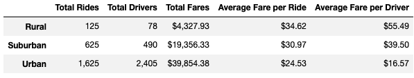

# PyBer_Analysis Report

## Background and Results

### Purpose
Pyber, a ride sharing app company, has assigned me the task of analyzing a large dataset from their ride share data. This data includes the type of city, number of riders, number of drivers, and ride fare cost. Results from this data are to drawn by utilizing matplotlib to plot the data and by creating pandas data frames to set up the data for plotting.

### Technical Analysis
The summary data table and plot for this challenge are shown below. The table shows rider, driver, and fare data based on city type. The multiple-line graph shows fare data for each week by city type.

### Results

### Summary

## Challenges Encountered and Overcome

### Challenges and Difficulties Encountered

* Programming

* Data analysis

* Graphing, etc

### Technical Analyses Used

## Recommendations and Next Steps

### Recommendations for Future Analysis

### Additional Analysis 1

* Description of Approach

* Technical Steps

### Additional Analysis 2

* Description of Approach

* Technical Steps